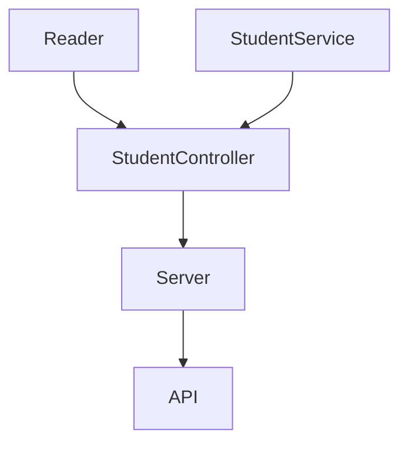

# Visual Thinking Code Challenge

## Inspiracion

Este proyecto nace de un Code Challange el cual @carlogilmar creo para el programa de LaunchX. El objetivo de esta practica es poder crear un API que a partir de un JSON provisto por Carlo que se encuentra [aqui](https://gist.github.com/carlogilmar/1f5164637fb77aecef3b9e6b9e2a9b63).

## Objetivo

Para poder realizar una simulacion de un proyecto mas realista, un cliente se acerca contigo pidiendote crear un API con tres endpoints clave:

1. Endpoint - Consulta de estudiantes con todos los campos.
2. Endpoint - Consulta de emails de estudiantes que cuenten con certificacion `haveCertification`.
3. Endpoint - Consulta estudiantes con `credits` mayor a 500.

## Como utilizar este repo?

Para correr el repositorio localmente tienes que clonar este repo ya sea con `git clone` o si lo prefieres con software como GitHub Desktop o Sourcetree. Este repo fue hecho con *Node.js* Version 17.7.1 pero puedes probar con otras versiones. Una vez que tienes Node instalado se tiene que agregas las dependencias abajo utilizadas.

## Dependecias Utilizadas

1. Jest 26.0.0 🧪 `npm install --save-dev jest `

Esta dependencia nos va a ayudar a correr las pruebas unitarias de nuestro codigo y funciones para asegurarnos que funcione de manera adecuada. Dentro de este proyecto encontramos las siguiente pruebas:

  - Prueba de Reader para verificar correcto funcionamiento de la lectura de la base de datos en formato JSON.
  - Prueba de StudentService checa que los servicios y funciones solicitadas realizen las operaciones adecuadas.
  - Prueba de StudentController para confirmar que nuestro archivo clave para el API devuelva informacion adecuada.

**La version de Jest es importante si quisieras correr con GitHub Actions las pruebas de unidad automaticas.**

2. Eslint 8.14.0 🧹 `npm install --save-dev eslint`

La herramienta que Eslint ofrece funcionalidades para poder "limpiar" el codigo bajo un estandar seleccionado. Para este repositorio se empleo el estandar de *Airbnb Javascript* 15.0.0 el cual tiene las reglas establecidas sobre las buenas practicas al momento de colocar el codigo. El objetivo final es poder mas mayor facilidad de lectura al codigo.

3. Express 4.18.1 📨 `npm install express --save`

La dependencia de Express la estamos empleando como framework para creacion de un servidor que pueda funcionar como API. Su funcion principal va a ser comunicarse con todos los modulos que establecimos en el programa para poder ser el puente con los requests de los usuarios.

## Diseño de Componentes

Para el diseño de los componentes decidi acomodarlos de la siguiente manera.

Debido a que muchos de los requerimientos son estaticos de una sola lista de estudiantes decidi integrar todoa la funcionalidad dentro del `StudentController` esto con el fin de poder manejar todos los cambios de la API desde ese mismo archivo.

## Como usar la API

Una vez se tienen todas las dependencias instaladas iniciamos la API con `npm run serve` y en `http://localhost:3000/` debemos de ver el siguiente mensaje para saber que abrio de manera correcta.

`{"message":"Visual Thinking Student API Welcome!"}`

Voy a mostrar un par de ejemplos de acuerdo a los requerimientos que Visual Thinking API establecio tomando en cuenta que todo lo que devuelve es en formato JSON. Para esta parte se puede consultar ya sea dentro de tu navegador o por medio de una herramienta para consulta de API como [Postman](https://www.postman.com/), te dejo en el repo un json con la coleccion de requests.

1. Consultar todos los estudiantes

  Para esta solicitud se puede ingresar a la API por medio de `http://localhost:3000/v1/students` donde se devolvera una de la siguiente manera la respuesta.

  `{"students": [Lista de Estudiantes con parametros]}`

2. Consultar emails de estudiantes con certificacion

  La solicitud se hace de la siguiente manera `http://localhost:3000/v1/students/emails` para este endpoint el criterio es que contengan el siguiente atributo `haveCertification:true` y devuelve de la lista de la siguiente manera.

  `{"Certified Students Emails": [Lista de emails]}`

3. Consultar estudiantes con creditos arriba de 500

  La solicitud se hace de la siguiente manera `http://localhost:3000/v1/students/credits` para este endpoint el criterio es que contengan mas de 500 creditos en el siguiente atributo `credits:500` y devuelve la lista de la siguiente manera

  `{"Students Over 500 Credits": [Lista de nombres]}`

## Cierre

Muchas gracas por tu visita, comentarios y feedback del proyecto.
Si te interesa mas ver a fondo la secuencia de como fue armado el proyecto visita la pestaña de *projects* de mi repo donde podras ver como lo dividi en tareas.
Te dejo la liga [aqui](https://github.com/rorrostieta/vp_codechallenge/projects/1).

Saludos
rorrostieta 🙃
