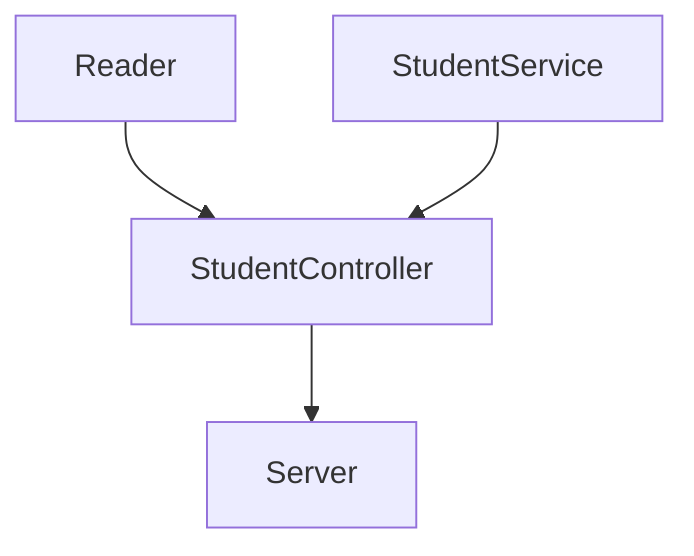

# Visual Thinking Code Challenge
## Dependecias Utilizadas

1. Jest 26.0.0 🧪
Esta dependencia nos va a ayudar a correr las pruebas unitarias de nuestro codigo y funciones para asegurarnos que funcione de manera adecuada. Dentro de este proyecto encontramos las siguiente pruebas:

  - Prueba de Reader para verificar correcto funcionamiento de la lectura de la base de datos en formato JSON.
  - Prueba de StudentService checa que los servicios y funciones solicitadas realizen las operaciones adecuadas.
  - Prueba de StudentController para confirmar que nuestro archivo clave para el API devuelva informacion adecuada.

2. Eslint 8.14.0 🧹
La herramienta que Eslint ofrece funcionalidades para poder "limpiar" el codigo bajo un estandar seleccionado. Para este repositorio se empleo el estandar de *Airbnb Javascript* 15.0.0 el cual tiene las reglas establecidas sobre las buenas practicas al momento de colocar el codigo. El objetivo final es poder mas mayor facilidad de lectura al codigo.

3. Express 4.18.1 📨
La dependencia de Express la estamos empleando como framework para creacion de un servidor que pueda funcionar como API. Su funcion principal va a ser comunicarse con todos los modulos que establecimos en el programa para poder ser el puente con los requests de los usuarios.

## Diseño de Componentes

Para el diseño de los componentes decidi acomodarlos de la siguiente manera.

